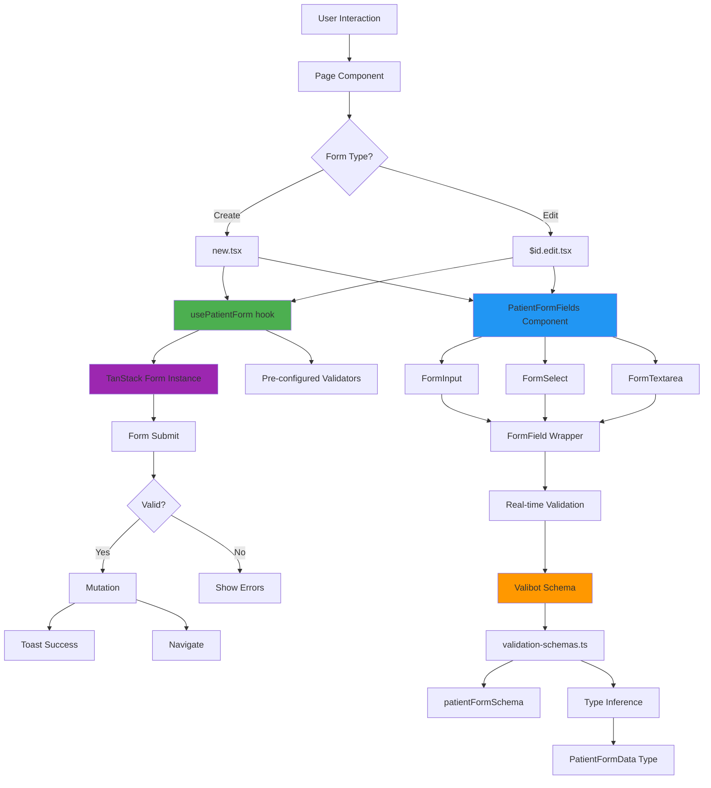

# Patient Forms Architecture - Visual Guide

## 🎯 Data Flow Diagram



## 🏗️ Component Hierarchy

```
┌─────────────────────────────────────────────────────────────┐
│                        Page Layout                          │
│  ┌───────────────────────────────────────────────────────┐  │
│  │                    PageContainer                      │  │
│  │  ┌─────────────────────────────────────────────────┐ │  │
│  │  │                  Card                           │ │  │
│  │  │  ┌───────────────────────────────────────────┐  │ │  │
│  │  │  │           FormContainer                   │  │ │  │
│  │  │  │  ┌─────────────────────────────────────┐  │  │ │  │
│  │  │  │  │      PatientFormFields             │  │  │ │  │
│  │  │  │  │  ┌───────────────────────────────┐ │  │  │ │  │
│  │  │  │  │  │      FormGroup               │ │  │  │ │  │
│  │  │  │  │  │  ┌─────────────────────────┐ │ │  │  │ │  │
│  │  │  │  │  │  │  FormField             │ │ │  │  │ │  │
│  │  │  │  │  │  │  ┌───────────────────┐ │ │ │  │  │ │  │
│  │  │  │  │  │  │  │   FormInput       │ │ │ │  │  │ │  │
│  │  │  │  │  │  │  │   - Label         │ │ │ │  │  │ │  │
│  │  │  │  │  │  │  │   - Input         │ │ │ │  │  │ │  │
│  │  │  │  │  │  │  │   - Error Msg     │ │ │ │  │  │ │  │
│  │  │  │  │  │  │  └───────────────────┘ │ │ │  │  │ │  │
│  │  │  │  │  │  └─────────────────────────┘ │ │  │  │ │  │
│  │  │  │  │  └───────────────────────────────┘ │  │  │ │  │
│  │  │  │  │                                     │  │  │ │  │
│  │  │  │  │  ┌───────────────────────────────┐ │  │  │ │  │
│  │  │  │  │  │      FormActions             │ │  │  │ │  │
│  │  │  │  │  │  [Cancel]  [Submit]          │ │  │  │ │  │
│  │  │  │  │  └───────────────────────────────┘ │  │  │ │  │
│  │  │  │  └─────────────────────────────────────┘  │  │ │  │
│  │  │  └───────────────────────────────────────────┘  │ │  │
│  │  └─────────────────────────────────────────────────┘ │  │
│  └───────────────────────────────────────────────────────┘  │
└─────────────────────────────────────────────────────────────┘
```

## 🔄 Validation Flow

```
User Types → Field onChange → valibotValidator
                                    ↓
                            Valibot Schema Parse
                                    ↓
                         ┌──────────┴──────────┐
                         │                     │
                    Valid ✓                Invalid ✗
                         │                     │
                  Clear Errors          Extract Messages
                         │                     │
                  Update State          Show in FormField
                         │                     │
                    Enable Submit         Disable Submit
                         └──────────┬──────────┘
                                    ↓
                            User Sees Result
```

## 📦 File Dependencies

```
┌──────────────────────────────────────────────────────────┐
│                    Application Layer                     │
│                                                          │
│  new.tsx ──────┐                                         │
│                ├──→ usePatientForm ──→ validation-schemas│
│  $id.edit.tsx ─┘         │                    ↓          │
│                          │              PatientFormData  │
│                          ↓                               │
│              PatientFormFields ──→ Form Components       │
│                          │              ↓                │
│                          │         FormInput             │
│                          │         FormSelect            │
│                          │         FormTextarea          │
│                          ↓              ↓                │
│                    form-utils ──→ valibotValidator       │
│                          │              ↓                │
│                    queries.ts ──→ TanStack Query         │
│                          │                               │
│                    toast.ts ──→ User Feedback            │
└──────────────────────────────────────────────────────────┘
```

## 🎨 State Management

```
┌─────────────────────────────────────────────────────────┐
│                    Form State Tree                      │
├─────────────────────────────────────────────────────────┤
│                                                         │
│  form.state                                             │
│  ├─ values                                              │
│  │  ├─ firstName: string                               │
│  │  ├─ lastName: string                                │
│  │  ├─ email: string                                   │
│  │  └─ ... (all form fields)                           │
│  │                                                      │
│  ├─ errors                                              │
│  │  ├─ firstName: string[]                             │
│  │  └─ ... (validation errors)                         │
│  │                                                      │
│  ├─ meta                                                │
│  │  ├─ isSubmitting: boolean                           │
│  │  ├─ isValidating: boolean                           │
│  │  ├─ canSubmit: boolean                              │
│  │  ├─ isDirty: boolean                                │
│  │  └─ isTouched: boolean                              │
│  │                                                      │
│  └─ fieldMeta                                           │
│     └─ firstName                                        │
│        ├─ value: string                                │
│        ├─ errors: string[]                             │
│        ├─ isTouched: boolean                           │
│        ├─ isDirty: boolean                             │
│        └─ isValidating: boolean                        │
└─────────────────────────────────────────────────────────┘
```

## 🚀 Lifecycle Diagram

```
┌──────────────────────────────────────────────────────────┐
│                    Form Lifecycle                        │
└──────────────────────────────────────────────────────────┘

1. Mount
   ├─ usePatientForm() called
   ├─ createForm() initializes
   ├─ Default values set
   └─ Form rendered

2. User Interaction
   ├─ User types in field
   ├─ onChange event fires
   ├─ Validator runs (debounced)
   ├─ State updates
   └─ UI re-renders with errors/success

3. Validation
   ├─ Field validation (onChange)
   ├─ Cross-field validation (onBlur)
   └─ Form-level validation (onSubmit)

4. Submit
   ├─ User clicks submit
   ├─ Prevent default
   ├─ Run all validators
   ├─ If invalid: Show errors
   └─ If valid: Continue

5. Mutation
   ├─ Call API (create or update)
   ├─ Show loading state
   ├─ Wait for response
   └─ Handle result

6. Success
   ├─ Show success toast
   ├─ Call onSuccess callback
   ├─ Navigate away
   └─ Optimistic update

7. Error
   ├─ Show error toast
   ├─ Call onError callback
   ├─ Keep form open
   └─ Allow retry

8. Cleanup
   ├─ Unmount form
   └─ Clear state
```

## 🎯 Hook Composition Pattern

```typescript
┌─────────────────────────────────────────────────────────┐
│              usePatientForm Composition                  │
└─────────────────────────────────────────────────────────┘

usePatientForm()
  ├─ useCreateRecord('patients')    // From queries.ts
  ├─ useUpdateRecord('patients')    // From queries.ts
  ├─ createForm()                   // From TanStack Form
  │   ├─ defaultValues              // Patient data
  │   ├─ onSubmit                   // Submit handler
  │   └─ validators                 // Field validators
  │
  └─ Returns:
      ├─ form                       // Form instance
      ├─ validators                 // Valibot validators
      ├─ isEditing                  // Computed state
      ├─ isPending                  // Mutation state
      ├─ isSubmitting()             // Form state
      └─ canSubmit()                // Form state
```

## 📊 Performance Optimization Points

```
┌─────────────────────────────────────────────────────────┐
│              Performance Optimizations                   │
└─────────────────────────────────────────────────────────┘

1. Validation Debouncing
   ├─ onChange: Immediate (local)
   ├─ onChangeAsync: 500ms debounce
   └─ Prevents excessive API calls

2. Selective Re-renders
   ├─ form.Subscribe with selector
   ├─ Only re-render when selected state changes
   └─ Avoids unnecessary DOM updates

3. Lazy Field Mounting
   ├─ Fields only render when visible
   ├─ Use <Show> for conditional fields
   └─ Reduces initial render cost

4. Optimistic Updates
   ├─ Navigate immediately after submit
   ├─ Update UI before server response
   └─ Rollback on error

5. Schema Memoization
   ├─ Define schemas outside components
   ├─ Reuse across renders
   └─ Avoid re-parsing
```

## 🎨 Dark Mode Support

```css
/* Automatic Dark Mode Classes */

Light Mode              Dark Mode
─────────────────────  ─────────────────────
bg-white            →  dark:bg-gray-800
text-gray-900       →  dark:text-gray-100
border-gray-300     →  dark:border-gray-600
text-gray-500       →  dark:text-gray-400
text-red-600        →  dark:text-red-400

/* Applied automatically in all form components */
```

## 🔗 Integration Points

```
┌─────────────────────────────────────────────────────────┐
│              External Integrations                       │
└─────────────────────────────────────────────────────────┘

Patient Forms
  │
  ├─ TanStack Router
  │   ├─ Route params (id)
  │   ├─ Navigation
  │   └─ Route guards
  │
  ├─ TanStack Query
  │   ├─ Data fetching (useRecord)
  │   ├─ Mutations (useCreateRecord, useUpdateRecord)
  │   ├─ Cache management
  │   └─ Optimistic updates
  │
  ├─ PocketBase
  │   ├─ API calls
  │   ├─ Real-time sync
  │   └─ Authentication
  │
  └─ UI Components
      ├─ PageLayout
      ├─ Card
      ├─ Button
      └─ Toast
```

---

## 📝 Quick Reference: Where to Edit

| Task | File | Location |
|------|------|----------|
| Add new field | `validation-schemas.ts` | `patientFormSchema` |
| | `PatientFormFields.tsx` | Add `<form.Field>` |
| Change validation | `validation-schemas.ts` | Update schema |
| Add new form type | Create `use[Type]Form.ts` | New hook |
| | Create `[Type]FormFields.tsx` | New component |
| Modify submit logic | `use-patient-form.ts` | `onSubmit` handler |
| Add field type | Create `Form[Type].tsx` | New component |
| Change layout | `PatientFormFields.tsx` | Update `<FormGroup>` |

---

This visual guide provides a comprehensive overview of how all the pieces fit together! 🎨
